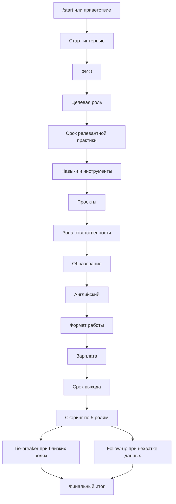

# HR Interview Bot

## 1. Описание проекта

HR Interview Bot - чат-бот для первичного интервью кандидатов на роли в ML- и data-команде. Бот проводит структурированное интервью, извлекает ключевые факты из свободного текста, рассчитывает объяснимый рейтинг ролей и формирует отчет для рекрутера.

Проект реализован на Rasa и поддерживает работу через Telegram и Rasa REST channel.

## 2. Поддерживаемые роли

Бот оценивает кандидата по пяти направлениям:

- Project Manager
- Data Analyst
- Data Engineer
- Data Scientist
- MLOps Engineer

Результат представлен не как один жесткий класс, а как ranking всех пяти ролей. Это позволяет видеть основную рекомендацию и ближайшие альтернативы.

## 3. Основные возможности

- Интервью в Telegram.
- Локальное тестирование через Rasa REST channel.
- Сбор ФИО, роли, опыта, навыков, проектов, образования, английского, формата работы, зарплаты и срока выхода.
- Извлечение нескольких фактов из одного сообщения, включая вставленное резюме.
- Поддержка разговорных формулировок, сокращений, русско-английских названий технологий и частых опечаток.
- Контекстные уточнения по текущему вопросу.
- Explainable scoring по пяти ролям.
- Tie-breaker вопросы при близких результатах.
- Follow-up вопросы перед финальным итогом.
- Candidate summary.
- Recruiter report.
- CSV/JSON export в `exports/`.

## 4. Пользовательский сценарий

Базовый сценарий интервью:

```text
/start
Давай
Иванов Иван
Data Analyst
2 года
SQL, Python, Power BI
Анализировал клиентов маркетплейса, делал дашборды
аналитик
бакалавриат по компьютерным наукам
Спокойно читаю документацию
гибрид
200к
завтра
```

В финале кандидат получает понятный итог:

```text
Иванов Иван, спасибо, интервью завершено.

Итог:
- По вашим ответам профиль ближе всего к направлению Data Analyst.
- Также можно рассмотреть: Data Scientist, Data Engineer.

Почему:
- релевантные навыки: SQL, статистика и аналитика, Power BI.
- есть аналитический опыт.

Следующий шаг: короткий созвон с рекрутером, чтобы уточнить опыт и ожидания.
```

## 5. Логика диалога

Диалог построен как управляемое интервью на Rasa Form. Это дает стабильный сбор обязательных данных и предсказуемое поведение на разных сценариях.



### Контекстная обработка

Ответ интерпретируется с учетом текущего вопроса.

| Текущий вопрос | Ответ кандидата | Интерпретация |
|---|---|---|
| Опыт | `3` | 3 года |
| Опыт | `6 месяцев` | 0.5 года |
| Опыт | `никогда` | 0 лет |
| Английский | `спокойно` | ориентировочно B1 |
| Английский | `очень хорошо` | ориентировочно B2 |
| Формат | `гибрид или офис` | сигнал hybrid / office |
| Зарплата | `200-300 тысяч` | зарплатный диапазон |
| Срок выхода | `завтра` | available_now |

### Извлечение фактов из одного сообщения

Если кандидат вставляет резюме или отвечает несколькими фактами сразу, бот может заполнить несколько slots за один ход.

Пример:

```text
ФИО: Петров Петр. Хочу на Data Analyst, 2 года опыта, SQL, Python, Power BI.
Анализировал клиентов маркетплейса, делал дашборды.
Бакалавриат по компьютерным наукам. Английский B2, гибрид, зарплата 200-250к.
```

Из такого сообщения извлекаются ФИО, роль, опыт, навыки, проектный сигнал, образование, английский, формат работы и зарплата.

## 6. Скоринговая модель

Для каждой роли рассчитывается независимый score от 0 до 100. Затем роли сортируются по убыванию score.

| Компонент | Максимум |
|---|---:|
| Релевантный опыт | 20 |
| Навыки | 35 |
| Проекты | 20 |
| Роль кандидата в проекте | 8 |
| Интерес к конкретной роли | 5 |
| Образование | 6 |
| Английский | 4 |
| Сложность проектов | 2 |
| Tie-breaker ответ | 7 |

### Ключевые навыки по ролям

| Роль | Основные сигналы |
|---|---|
| Project Manager | stakeholders, people management, communication, planning, risk management, Scrum, Jira |
| Data Analyst | SQL, statistics, A/B tests, BI, Excel |
| Data Engineer | SQL, Python, Airflow, Spark, Kafka, ETL, DWH |
| Data Scientist | Python, ML, statistics, sklearn, PyTorch, TensorFlow |
| MLOps Engineer | Docker, Kubernetes, CI/CD, MLflow, monitoring |

### Статусы

| Top score | Статус |
|---:|---|
| 70-100 | `fit` |
| 50-69.9 | `borderline` |
| 0-49.9 | `reject` |

### Risk flags

Risk flags сохраняются в recruiter report и помогают рекрутеру понять, какие детали стоит проверить на следующем этапе:

- мало релевантного опыта;
- не хватает ключевых навыков для верхней роли;
- зарплатные ожидания выше типичного диапазона;
- слабый или неизвестный английский;
- нет признаков проектов промышленной сложности;
- срок выхода требует согласования;
- выбранное кандидатом направление отличается от рекомендованного.

## 7. Архитектура

```text
Telegram
   |
   v
Rasa Server
   |
   +--> Rasa NLU: intents, entities, synonyms, lookup tables
   |
   +--> Rasa Form: управляемый сбор обязательных полей
   |
   +--> Action Server: валидация, извлечение фактов, скоринг, export
```

## 8. Структура проекта

```text
.
├── actions/
│   └── actions.py
├── data/
│   ├── nlu.yml
│   ├── rules.yml
│   └── stories.yml
├── models/
│   └── 20260514-142209-ambitious-head.tar.gz
├── scripts/
│   ├── dialog_smoke.py
│   └── start_telegram.ps1
├── config.yml
├── credentials.yml
├── domain.yml
├── endpoints.yml
├── telegram_channel.py
├── docker-compose.yml
├── Dockerfile
├── requirements.txt
└── README.md
```

### Основные файлы

- `domain.yml` - intents, entities, slots, form, responses, custom actions.
- `data/nlu.yml` - обучающие примеры, synonyms и lookup tables.
- `data/rules.yml` - правила диалога, form flow, fallback, follow-up и справочные ответы.
- `actions/actions.py` - бизнес-логика: парсинг, нормализация, валидация, скоринг, отчеты.
- `telegram_channel.py` - кастомный Telegram connector для стабильной работы на Windows.
- `scripts/dialog_smoke.py` - smoke-тесты диалоговых сценариев через REST.
- `scripts/start_telegram.ps1` - быстрый запуск Telegram-бота одной командой на Windows.
- `exports/` - JSON/CSV результаты интервью.

## 9. Актуальная модель

Локально сейчас используется обученная модель:

```text
models\20260514-142209-ambitious-head.tar.gz
```

Папка `models/` добавлена в `.gitignore`, поэтому после чистого `git clone` модели может не быть. В таком случае обучите ее командой из раздела 10.4.

## 10. Быстрый запуск после `git clone`

Все команды выполняются из корня проекта. Для Rasa используйте Python 3.10.

После клонирования в репозитории обычно нет локальных runtime-файлов: `.venv/`, `credentials.yml`, `models/`, `exports/`. Это нормально: они создаются на машине разработчика и не хранятся в Git.

### 10.1. Установка зависимостей на Windows

```powershell
cd "C:\path\to\nlp-gp-2026"
py -3.10 -m venv .venv
.\.venv\Scripts\Activate.ps1
python -m pip install --upgrade pip setuptools wheel
pip install -r requirements.txt
```

Если PowerShell запрещает активацию venv:

```powershell
Set-ExecutionPolicy -Scope CurrentUser RemoteSigned
```

### 10.2. Установка зависимостей на macOS M-series

Рекомендуемый вариант - отдельное окружение Python 3.10 через conda:

```bash
cd /path/to/nlp-gp-2026
conda create -n rasa310 python=3.10 -y
conda activate rasa310
python -m pip install --upgrade pip setuptools wheel
pip install -r requirements.txt
```

Если зависимости Rasa конфликтуют на ARM, создайте x64-окружение через Rosetta:

```bash
CONDA_SUBDIR=osx-64 conda create -n rasa310_x64 python=3.10 -y
conda activate rasa310_x64
conda config --env --set subdir osx-64
python -m pip install --upgrade pip setuptools wheel
pip install -r requirements.txt
```

### 10.3. Создание `credentials.yml`

Файл `credentials.yml` игнорируется Git, потому что для Telegram в нем используются локальные секреты. Создайте файл в корне проекта:

```yaml
rest:

rasa:
  url: "http://localhost:5002/api"

telegram_channel.FixedTelegramInput:
  access_token: "${TELEGRAM_TOKEN}"
  verify: "BOT_USERNAME_WITHOUT_AT"
  webhook_url: "${TELEGRAM_WEBHOOK_URL}"
```

`verify` - это username бота без `@`, например `nlu_rasabot`. Сам токен в файл не записывайте, он передается через переменную окружения `TELEGRAM_TOKEN`.

### 10.4. Обучение модели

Так как `models/` не хранится в Git, после свежего клона нужно обучить модель:

Windows:

```powershell
$env:TEMP='C:\rasa_tmp'
$env:TMP='C:\rasa_tmp'
$env:PYTHONIOENCODING='utf-8'
$env:SQLALCHEMY_SILENCE_UBER_WARNING='1'
.\.venv\Scripts\python.exe -m rasa data validate
.\.venv\Scripts\python.exe -m rasa train --force
```

macOS/Linux:

```bash
export PYTHONIOENCODING=utf-8
export SQLALCHEMY_SILENCE_UBER_WARNING=1
python -m rasa data validate
python -m rasa train --force
```

После обучения в папке `models/` появится файл вида `YYYYMMDD-HHMMSS-name.tar.gz`.

## 11. Запуск Telegram одной командой

Для Telegram нужны:

- Telegram Bot API token из BotFather;
- установленный `cloudflared`;
- обученная модель в `models/`;
- файл `credentials.yml` из раздела 10.3.

Для публичного HTTPS URL используется `cloudflared`. Он нужен, потому что Telegram отправляет сообщения только на публичный HTTPS webhook, а локальный Rasa server работает на `127.0.0.1:5005`.

Скрипт `scripts/start_telegram.ps1` сам запускает все внутренние части: action server, tunnel, Rasa server и Telegram webhook. Обычно вручную запускать отдельные Rasa-команды не нужно.

### 11.1. Установка и проверка cloudflared

Windows:

1. Скачайте `cloudflared.exe` с [официальной страницы Cloudflare](https://developers.cloudflare.com/cloudflare-one/connections/connect-networks/downloads/).
2. Положите файл в постоянную папку, например:

```text
C:\tools\cloudflared\cloudflared.exe
```

3. Проверьте, что файл существует:

```powershell
Test-Path 'C:\tools\cloudflared\cloudflared.exe'
```

Если хотите запускать просто `cloudflared`, добавьте папку в `PATH` и откройте новый PowerShell:

```powershell
setx PATH "$env:PATH;C:\tools\cloudflared"
```

Проверка:

```powershell
cloudflared --version
```

Если `cloudflared --version` не работает, используйте запуск с явным путем через параметр `-CloudflaredPath`.

macOS:

```bash
brew install cloudflare/cloudflare/cloudflared
cloudflared --version
```

### 11.2. Запуск на Windows

Если `cloudflared` доступен из терминала:

```powershell
cd "C:\path\to\nlp-gp-2026"
.\scripts\start_telegram.ps1 -TelegramToken 'TOKEN_FROM_BOTFATHER'
```

Если PowerShell не разрешает запуск `.ps1`, используйте:

```powershell
powershell -ExecutionPolicy Bypass -File .\scripts\start_telegram.ps1 -TelegramToken 'TOKEN_FROM_BOTFATHER'
```

Если `cloudflared` не добавлен в `PATH`, передайте путь явно:

```powershell
.\scripts\start_telegram.ps1 -TelegramToken 'TOKEN_FROM_BOTFATHER' -CloudflaredPath 'C:\tools\cloudflared\cloudflared.exe'
```

То же самое через `ExecutionPolicy Bypass`:

```powershell
powershell -ExecutionPolicy Bypass -File .\scripts\start_telegram.ps1 -TelegramToken 'TOKEN_FROM_BOTFATHER' -CloudflaredPath 'C:\tools\cloudflared\cloudflared.exe'
```

Скрипт:

- остановит старые процессы на портах `5005` и `5055`;
- запустит action server;
- запустит `cloudflared` на `http://127.0.0.1:5005`;
- найдет публичную ссылку `https://...trycloudflare.com`;
- запустит Rasa server с правильным `TELEGRAM_WEBHOOK_URL`;
- установит Telegram webhook;
- покажет итоговый webhook URL.

Скрипт корректно работает с путями проекта, где есть пробелы или кириллица. Модель выбирается автоматически: берется самый новый `.tar.gz` из папки `models/`.

Логи запуска пишутся в `.runtime/`:

```text
.runtime/actions.err.log
.runtime/rasa.err.log
.runtime/cloudflared.err.log
```

После успешного запуска в терминале появится:

```text
Telegram bot is running.
Public URL: https://...trycloudflare.com
Webhook URL: https://...trycloudflare.com/webhooks/telegram/webhook
```

После этого отправьте боту `/start` в Telegram.

### 11.3. Запуск на macOS/Linux

Для macOS/Linux автоматический PowerShell-скрипт не является основным сценарием. Используйте ручной запуск из раздела 12.2 или адаптируйте `scripts/start_telegram.ps1` под `pwsh`.

### 11.4. Частые проблемы cloudflared и запуска

- `cloudflared was not found` - `cloudflared` не добавлен в `PATH`. Запустите скрипт с `-CloudflaredPath 'C:\tools\cloudflared\cloudflared.exe'`.
- `Cloudflared URL was not found` - проверьте `.runtime/cloudflared.err.log`. Если там есть ссылка `https://...trycloudflare.com`, обновите скрипт до последней версии. Если ссылки нет, перезапустите команду или проверьте интернет/VPN.
- `Token is invalid!` - передан неправильный или неполный токен. Нужен полный токен из BotFather вида `1234567890:AA...`.
- Бот не отвечает на `/start` - проверьте `getWebhookInfo`: поле `url` должно вести на текущий `trycloudflare.com` URL, а `last_error_message` должно быть пустым.
- `Cannot connect to host localhost:5055` - action server не запущен или запущен не на `5055`.
- `cloudflared` не распознан после добавления в `PATH` - закройте PowerShell и откройте заново.
- При новом запуске `cloudflared` меняет публичный URL. Скрипт обновляет webhook сам; при ручном запуске webhook нужно поставить заново.
- Если в логах `cloudflared` есть `dial tcp [::1]:5005`, tunnel запущен через IPv6 localhost. Используйте `http://127.0.0.1:5005`.
- Если скрипт пишет `Starting Rasa server...` и долго ничего не происходит, Rasa может грузить модель несколько минут. Если через 5-6 минут запуска нет, смотрите `.runtime/rasa.err.log`.

## 12. Отладка и ручной запуск

Этот раздел нужен только для разработки и диагностики. Для обычного запуска Telegram-бота используйте раздел 11.

### 12.1. Локальный запуск без Telegram

Windows, терминал 1:

```powershell
cd "C:\path\to\nlp-gp-2026"
$env:TEMP='C:\rasa_tmp'
$env:TMP='C:\rasa_tmp'
$env:PYTHONIOENCODING='utf-8'
$env:SQLALCHEMY_SILENCE_UBER_WARNING='1'
.\.venv\Scripts\python.exe -m rasa run actions --actions actions
```

Windows, терминал 2:

```powershell
cd "C:\path\to\nlp-gp-2026"
$env:TEMP='C:\rasa_tmp'
$env:TMP='C:\rasa_tmp'
$env:PYTHONIOENCODING='utf-8'
$env:SQLALCHEMY_SILENCE_UBER_WARNING='1'
$MODEL_NAME=(Get-ChildItem .\models\*.tar.gz | Sort-Object LastWriteTime -Descending | Select-Object -First 1).Name
$MODEL_PATH="models\$MODEL_NAME"
.\.venv\Scripts\python.exe -m rasa run --enable-api --credentials credentials.yml --endpoints endpoints.yml --model "$MODEL_PATH" --cors "*"
```

macOS/Linux, терминал 1:

```bash
cd /path/to/nlp-gp-2026
export PYTHONIOENCODING=utf-8
export SQLALCHEMY_SILENCE_UBER_WARNING=1
python -m rasa run actions --actions actions
```

macOS/Linux, терминал 2:

```bash
cd /path/to/nlp-gp-2026
export PYTHONIOENCODING=utf-8
export SQLALCHEMY_SILENCE_UBER_WARNING=1
MODEL="$(ls -t models/*.tar.gz | head -n 1)"
python -m rasa run --enable-api --credentials credentials.yml --endpoints endpoints.yml --model "$MODEL" --cors "*"
```

REST endpoint для тестов:

```text
http://localhost:5005/webhooks/rest/webhook
```

### 12.2. Ручной Telegram-запуск

Ручной Telegram-запуск состоит из четырех процессов: action server, `cloudflared`, Rasa server и установка webhook. Он нужен только если автоматический скрипт не подходит.

1. Запустите action server командой из раздела 12.1.

2. Запустите tunnel:

```powershell
cloudflared tunnel --url http://127.0.0.1:5005
```

3. Скопируйте URL вида `https://name.trycloudflare.com`, задайте переменные и запустите Rasa server:

```powershell
$env:TELEGRAM_TOKEN='TOKEN_FROM_BOTFATHER'
$env:TELEGRAM_WEBHOOK_URL='https://name.trycloudflare.com/webhooks/telegram/webhook'
$MODEL_NAME=(Get-ChildItem .\models\*.tar.gz | Sort-Object LastWriteTime -Descending | Select-Object -First 1).Name
$MODEL_PATH="models\$MODEL_NAME"
.\.venv\Scripts\python.exe -m rasa run --enable-api --credentials credentials.yml --endpoints endpoints.yml --model "$MODEL_PATH" --cors "*"
```

4. В отдельном терминале поставьте webhook:

```powershell
$publicUrl='https://name.trycloudflare.com'
Invoke-RestMethod -Uri "$publicUrl/webhooks/telegram/set_webhook" -Method Post
```

## 13. Проверка качества

### Python compile

```powershell
python -m py_compile actions\actions.py telegram_channel.py
```

### Rasa validation

```powershell
.\.venv\Scripts\python.exe -m rasa data validate
```

### Smoke-тесты

```powershell
python scripts\dialog_smoke.py
```

Результаты пишутся в:

```text
dialog_smoke_output.jsonl
```

Файл игнорируется Git.

## 14. Экспорт результатов

После завершения интервью создаются:

- JSON report;
- CSV row для табличного анализа.

Папка:

```text
exports/
```

Экспорт содержит:

- candidate summary;
- ranking ролей;
- score breakdown;
- recommended role;
- decision status;
- risk flags;
- next step.

## 15. Runtime artifacts

В Git не попадают:

- `.venv/`
- `.rasa/`
- `credentials.yml`
- `models/`
- `exports/`
- `*.log`
- `*.err`
- `*.out`
- `dialog_smoke_output.jsonl`
- `__pycache__/`

## 16. Дорожная карта

Рекомендуемые следующие улучшения:

- recruiter dashboard поверх `exports/*.json`;
- regression-тесты с проверкой expected slots и role ranking;
- расширение корпуса реальных Telegram-диалогов;
- LLM-модуль для более естественного candidate feedback;
- fuzzy matching для редких опечаток в названиях технологий;
- recruiter-only страница с деталями score breakdown.

## 17. Команда проекта

- Тимофей Морозов
- Дарья Осина
- Шинкарев Роман
- Мелехин Матвей
