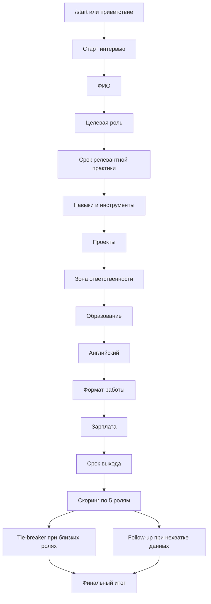

# HR Interview Bot

## 1. Описание проекта

HR Interview Bot - чат-бот для первичного интервью кандидатов на роли в ML- и data-команде. Бот проводит структурированное интервью, извлекает ключевые факты из свободного текста, рассчитывает объяснимый рейтинг ролей и формирует отчет для рекрутера.

Проект реализован на Rasa и поддерживает работу через Telegram и Rasa REST channel.

## 2. Поддерживаемые роли

Бот оценивает кандидата по пяти направлениям:

- Project Manager
- Data Analyst
- Data Engineer
- Data Scientist
- MLOps Engineer

Результат представлен не как один жесткий класс, а как ranking всех пяти ролей. Это позволяет видеть основную рекомендацию и ближайшие альтернативы.

## 3. Основные возможности

- Интервью в Telegram.
- Локальное тестирование через Rasa REST channel.
- Сбор ФИО, роли, опыта, навыков, проектов, образования, английского, формата работы, зарплаты и срока выхода.
- Извлечение нескольких фактов из одного сообщения, включая вставленное резюме.
- Поддержка разговорных формулировок, сокращений, русско-английских названий технологий и частых опечаток.
- Контекстные уточнения по текущему вопросу.
- Explainable scoring по пяти ролям.
- Tie-breaker вопросы при близких результатах.
- Follow-up вопросы перед финальным итогом.
- Candidate summary.
- Recruiter report.
- CSV/JSON export в `exports/`.

## 4. Пользовательский сценарий

Базовый сценарий интервью:

```text
/start
Давай
Иванов Иван
Data Analyst
2 года
SQL, Python, Power BI
Анализировал клиентов маркетплейса, делал дашборды
аналитик
бакалавриат по компьютерным наукам
Спокойно читаю документацию
гибрид
200к
завтра
```

В финале кандидат получает понятный итог:

```text
Иванов Иван, спасибо, интервью завершено.

Итог:
- По вашим ответам профиль ближе всего к направлению Data Analyst.
- Также можно рассмотреть: Data Scientist, Data Engineer.

Почему:
- релевантные навыки: SQL, статистика и аналитика, Power BI.
- есть аналитический опыт.

Следующий шаг: короткий созвон с рекрутером, чтобы уточнить опыт и ожидания.
```

## 5. Логика диалога

Диалог построен как управляемое интервью на Rasa Form. Это дает стабильный сбор обязательных данных и предсказуемое поведение на разных сценариях.



### Контекстная обработка

Ответ интерпретируется с учетом текущего вопроса.

| Текущий вопрос | Ответ кандидата | Интерпретация |
|---|---|---|
| Опыт | `3` | 3 года |
| Опыт | `6 месяцев` | 0.5 года |
| Опыт | `никогда` | 0 лет |
| Английский | `спокойно` | ориентировочно B1 |
| Английский | `очень хорошо` | ориентировочно B2 |
| Формат | `гибрид или офис` | сигнал hybrid / office |
| Зарплата | `200-300 тысяч` | зарплатный диапазон |
| Срок выхода | `завтра` | available_now |

### Извлечение фактов из одного сообщения

Если кандидат вставляет резюме или отвечает несколькими фактами сразу, бот может заполнить несколько slots за один ход.

Пример:

```text
ФИО: Петров Петр. Хочу на Data Analyst, 2 года опыта, SQL, Python, Power BI.
Анализировал клиентов маркетплейса, делал дашборды.
Бакалавриат по компьютерным наукам. Английский B2, гибрид, зарплата 200-250к.
```

Из такого сообщения извлекаются ФИО, роль, опыт, навыки, проектный сигнал, образование, английский, формат работы и зарплата.

## 6. Скоринговая модель

Для каждой роли рассчитывается независимый score от 0 до 100. Затем роли сортируются по убыванию score.

| Компонент | Максимум |
|---|---:|
| Релевантный опыт | 20 |
| Навыки | 35 |
| Проекты | 20 |
| Роль кандидата в проекте | 8 |
| Интерес к конкретной роли | 5 |
| Образование | 6 |
| Английский | 4 |
| Сложность проектов | 2 |
| Tie-breaker ответ | 7 |

### Ключевые навыки по ролям

| Роль | Основные сигналы |
|---|---|
| Project Manager | stakeholders, people management, communication, planning, risk management, Scrum, Jira |
| Data Analyst | SQL, statistics, A/B tests, BI, Excel |
| Data Engineer | SQL, Python, Airflow, Spark, Kafka, ETL, DWH |
| Data Scientist | Python, ML, statistics, sklearn, PyTorch, TensorFlow |
| MLOps Engineer | Docker, Kubernetes, CI/CD, MLflow, monitoring |

### Статусы

| Top score | Статус |
|---:|---|
| 70-100 | `fit` |
| 50-69.9 | `borderline` |
| 0-49.9 | `reject` |

### Risk flags

Risk flags сохраняются в recruiter report и помогают рекрутеру понять, какие детали стоит проверить на следующем этапе:

- мало релевантного опыта;
- не хватает ключевых навыков для верхней роли;
- зарплатные ожидания выше типичного диапазона;
- слабый или неизвестный английский;
- нет признаков проектов промышленной сложности;
- срок выхода требует согласования;
- выбранное кандидатом направление отличается от рекомендованного.

## 7. Архитектура

```text
Telegram
   |
   v
Rasa Server
   |
   +--> Rasa NLU: intents, entities, synonyms, lookup tables
   |
   +--> Rasa Form: управляемый сбор обязательных полей
   |
   +--> Action Server: валидация, извлечение фактов, скоринг, export
```

## 8. Структура проекта

```text
.
├── actions/
│   └── actions.py
├── data/
│   ├── nlu.yml
│   ├── rules.yml
│   └── stories.yml
├── models/
│   └── 20260513-203627-giant-root.tar.gz
├── scripts/
│   └── dialog_smoke.py
├── config.yml
├── credentials.yml
├── domain.yml
├── endpoints.yml
├── telegram_channel.py
├── docker-compose.yml
├── Dockerfile
├── requirements.txt
└── README.md
```

### Основные файлы

- `domain.yml` - intents, entities, slots, form, responses, custom actions.
- `data/nlu.yml` - обучающие примеры, synonyms и lookup tables.
- `data/rules.yml` - правила диалога, form flow, fallback, follow-up и справочные ответы.
- `actions/actions.py` - бизнес-логика: парсинг, нормализация, валидация, скоринг, отчеты.
- `telegram_channel.py` - кастомный Telegram connector для стабильной работы на Windows.
- `scripts/dialog_smoke.py` - smoke-тесты диалоговых сценариев через REST.
- `exports/` - JSON/CSV результаты интервью.

## 9. Актуальная модель

Актуальная обученная модель:

```text
models\20260513-203627-giant-root.tar.gz
```

В рабочей папке оставлена только актуальная модель. Папка `models/` добавлена в `.gitignore`, поэтому новые локальные модели не попадают в Git автоматически.

## 10. Запуск локально

Все команды выполняются из корня проекта.

### Windows PowerShell

```powershell
cd "C:\Users\rsink\OneDrive\Рабочий стол\NLP\ChatBotHR\nlp-gp-2026"

$env:TEMP='C:\rasa_tmp'
$env:TMP='C:\rasa_tmp'
$env:PYTHONIOENCODING='utf-8'
$env:SQLALCHEMY_SILENCE_UBER_WARNING='1'
```

В первом терминале запускается action server:

```powershell
.\.venv\Scripts\python.exe -m rasa run actions --actions actions
```

Во втором терминале запускается Rasa server:

```powershell
.\.venv\Scripts\python.exe -m rasa run --enable-api --credentials credentials.yml --endpoints endpoints.yml --model models\20260513-203627-giant-root.tar.gz --cors "*"
```

Проверка:

```powershell
Invoke-WebRequest -UseBasicParsing http://localhost:5055/health
Invoke-WebRequest -UseBasicParsing http://localhost:5005/status
```

REST endpoint для тестов:

```text
http://localhost:5005/webhooks/rest/webhook
```

### macOS на M-series

Рекомендуется запуск через Python 3.10. Если зависимости Rasa конфликтуют на ARM, используйте окружение x64 через Rosetta.

```bash
cd /path/to/nlp-gp-2026

conda create -n rasa310 python=3.10 -y
conda activate rasa310
pip install --upgrade pip setuptools wheel
pip install -r requirements.txt
```

Если обычное ARM-окружение не ставится:

```bash
CONDA_SUBDIR=osx-64 conda create -n rasa310_x64 python=3.10 -y
conda activate rasa310_x64
conda config --env --set subdir osx-64
pip install --upgrade pip setuptools wheel
pip install -r requirements.txt
```

Action server:

```bash
export PYTHONIOENCODING=utf-8
export SQLALCHEMY_SILENCE_UBER_WARNING=1
python -m rasa run actions --actions actions
```

Rasa server:

```bash
export PYTHONIOENCODING=utf-8
export SQLALCHEMY_SILENCE_UBER_WARNING=1
python -m rasa run --enable-api --credentials credentials.yml --endpoints endpoints.yml --model models/20260513-203627-giant-root.tar.gz --cors "*"
```

### Валидация и обучение

Windows:

```powershell
.\.venv\Scripts\python.exe -m rasa data validate
.\.venv\Scripts\python.exe -m rasa train --force
```

macOS/Linux:

```bash
python -m rasa data validate
python -m rasa train --force
```

Ожидаемый успешный результат валидации:

```text
No story structure conflicts found.
```

### Rasa shell

Для локального тестирования без Telegram:

```powershell
.\.venv\Scripts\python.exe -m rasa shell --model models\20260513-203627-giant-root.tar.gz
```

macOS/Linux:

```bash
python -m rasa shell --model models/20260513-203627-giant-root.tar.gz
```

## 11. Запуск Telegram

Для Telegram нужны Telegram Bot API token, public HTTPS URL для webhook, запущенный action server на `5055` и Rasa server на `5005`.

В `credentials.yml` должен быть кастомный канал:

```yaml
telegram_channel.FixedTelegramInput:
  access_token: "${TELEGRAM_TOKEN}"
  verify: "nlu_rasabot"
  webhook_url: "${TELEGRAM_WEBHOOK_URL}"
```

Стандартный ключ `telegram:` использовать не нужно: он может падать на части версий `aiogram`.

### Windows Telegram

Терминал 1:

```powershell
cd "C:\Users\rsink\OneDrive\Рабочий стол\NLP\ChatBotHR\nlp-gp-2026"
$env:TEMP='C:\rasa_tmp'
$env:TMP='C:\rasa_tmp'
$env:PYTHONIOENCODING='utf-8'
$env:SQLALCHEMY_SILENCE_UBER_WARNING='1'
.\.venv\Scripts\python.exe -m rasa run actions --actions actions
```

Терминал 2:

```powershell
C:\tmp\cloudflared.exe tunnel --url http://localhost:5005
```

Скопируйте URL вида `https://name.trycloudflare.com`.

Терминал 3:

```powershell
cd "C:\Users\rsink\OneDrive\Рабочий стол\NLP\ChatBotHR\nlp-gp-2026"
$env:TELEGRAM_TOKEN='TOKEN_FROM_BOTFATHER'
$env:TELEGRAM_WEBHOOK_URL='https://name.trycloudflare.com/webhooks/telegram/webhook'
$env:TEMP='C:\rasa_tmp'
$env:TMP='C:\rasa_tmp'
$env:PYTHONIOENCODING='utf-8'
$env:SQLALCHEMY_SILENCE_UBER_WARNING='1'
.\.venv\Scripts\python.exe -m rasa run --enable-api --credentials credentials.yml --endpoints endpoints.yml --model models\20260513-203627-giant-root.tar.gz --cors "*"
```

Терминал 4:

```powershell
$env:TELEGRAM_TOKEN='TOKEN_FROM_BOTFATHER'
$publicUrl='https://name.trycloudflare.com'
Invoke-RestMethod -Uri "https://api.telegram.org/bot$env:TELEGRAM_TOKEN/setWebhook" -Method Post -Body @{
  url = "$publicUrl/webhooks/telegram/webhook"
  drop_pending_updates = "true"
}
Invoke-RestMethod -Uri "https://api.telegram.org/bot$env:TELEGRAM_TOKEN/getWebhookInfo"
```

### macOS Telegram

```bash
cloudflared tunnel --url http://localhost:5005
```

В отдельном терминале:

```bash
export TELEGRAM_TOKEN='TOKEN_FROM_BOTFATHER'
export TELEGRAM_WEBHOOK_URL='https://name.trycloudflare.com/webhooks/telegram/webhook'
export PYTHONIOENCODING=utf-8
export SQLALCHEMY_SILENCE_UBER_WARNING=1
python -m rasa run --enable-api --credentials credentials.yml --endpoints endpoints.yml --model models/20260513-203627-giant-root.tar.gz --cors "*"
```

Установка webhook:

```bash
export TELEGRAM_TOKEN='TOKEN_FROM_BOTFATHER'
PUBLIC_URL='https://name.trycloudflare.com'
curl -X POST "https://api.telegram.org/bot$TELEGRAM_TOKEN/setWebhook" \
  -d "url=$PUBLIC_URL/webhooks/telegram/webhook" \
  -d "drop_pending_updates=true"
curl "https://api.telegram.org/bot$TELEGRAM_TOKEN/getWebhookInfo"
```

## 12. Проверка качества

### Python compile

```powershell
python -m py_compile actions\actions.py telegram_channel.py
```

### Rasa validation

```powershell
.\.venv\Scripts\python.exe -m rasa data validate
```

### Smoke-тесты

```powershell
python scripts\dialog_smoke.py
```

Результаты пишутся в:

```text
dialog_smoke_output.jsonl
```

Файл игнорируется Git.

## 13. Экспорт результатов

После завершения интервью создаются:

- JSON report;
- CSV row для табличного анализа.

Папка:

```text
exports/
```

Экспорт содержит:

- candidate summary;
- ranking ролей;
- score breakdown;
- recommended role;
- decision status;
- risk flags;
- next step.

## 14. Runtime artifacts

В Git не попадают:

- `.venv/`
- `.rasa/`
- `models/`
- `exports/`
- `*.log`
- `dialog_smoke_output.jsonl`
- `__pycache__/`

## 15. Дорожная карта

Рекомендуемые следующие улучшения:

- recruiter dashboard поверх `exports/*.json`;
- regression-тесты с проверкой expected slots и role ranking;
- расширение корпуса реальных Telegram-диалогов;
- LLM-модуль для более естественного candidate feedback;
- fuzzy matching для редких опечаток в названиях технологий;
- recruiter-only страница с деталями score breakdown.

## 16. Команда проекта

- Тимофей Морозов
- Дарья Осина
- Шинкарев Роман
- Мелехин Матвей
